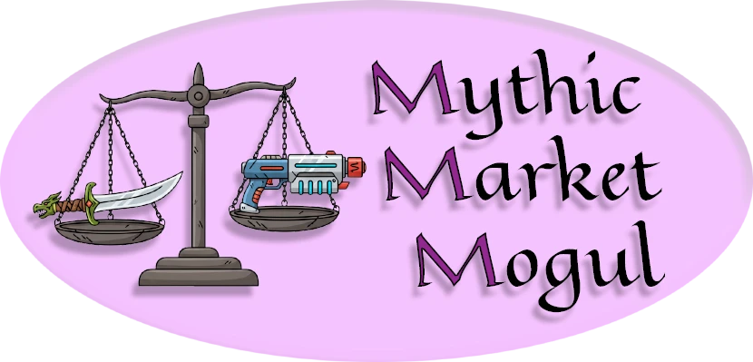

# Mythic Market Mogul - Multi-Game Investment Analyzer

A Node.js application that analyzes in-game market data to find profitable premium currency trading opportunities across multiple MMO games.

## Live Reports

- **Old School Runescape Report**: https://reports.vineyardtechnologies.org/osrs/
- **EVE Online Report**: https://reports.vineyardtechnologies.org/eve/

Updated daily with fresh market analysis and investment recommendations.

## Features

### Old School Runescape Market Analysis Report
- Fetches live item data from the OSRS item database
- Analyzes 180-day price history for any number of items
- Supports both F2P and Members items
- User-customizable investment budget (supports "2.5m", "500k", "6b" format)
- Random sampling for faster analysis
- Smart filtering:
  - Respects Grand Exchange buy limits
  - Ensures sufficient market volume (max 10% of daily volume)
  - Filters by membership status
- Investment metrics:
  - Price change percentage
  - Price volatility (high volatility = good for this strategy)
  - Recent momentum (30-day vs 60-day trends)
  - Investment score (0-100)
- Displays top 3 high-volatility, high-ROI recommendations

### EVE Online Market Analysis Report
- Fetches all tradeable items in Jita (The Forge region)
- Analyzes market history for dynamic item selection
- User-customizable ISK budget (supports "2.5b", "500m", "1000k" format)
- Smart filtering:
  - Ensures sufficient market liquidity (max 10% of daily volume)
  - Dynamically loads all available market items
- Investment metrics:
  - Price change percentage over available history
  - Price volatility (standard deviation analysis)
  - Recent momentum (30-day vs 60-day comparison)
  - Investment score (0-100) optimized for EVE markets
- Displays top 3 high-volatility investment opportunities

## How It Works

### OSRS Analysis Process

1. **Data Collection**: 
   - Fetches live item database from `https://chisel.weirdgloop.org/gazproj/gazbot/os_dump.json`
   - Fetches 180-day price history from `https://secure.runescape.com/m=itemdb_oldschool/api/graph/{itemId}.json`
2. **Filtering**:
   - Removes items without required data (price, volume)
   - Filters by membership status (F2P vs Members)
   - Excludes items where purchase would exceed GE buy limit (when limit exists)
   - Items without buy limit data are included (unlimited purchase potential)
   - Excludes items with insufficient volume (rejects if purchase > 10% of daily volume)
3. **Analysis**: Calculates multiple metrics:
   - Overall price change over 180 days
   - Price volatility (standard deviation as % of mean)
   - Recent momentum (30-day vs 60-day average comparison)
4. **Scoring**: Generates investment score (0-100) based on:
   - **High volatility** (20%+ volatility gets max points)
   - **Strong momentum** (positive short-term trends)
   - **Price movement** (40%+ price change favored)
   - **Affordability** (cheap items = buy more units)
   - Breakout patterns (bonus points)

### EVE Online Analysis Process

1. **Data Collection**:
   - Fetches all tradeable items in Jita from `https://esi.evetech.net/latest/markets/{regionId}/types/`
   - Resolves item names using `https://esi.evetech.net/latest/universe/names/`
   - Fetches market history from `https://esi.evetech.net/latest/markets/{regionId}/history/`
2. **Filtering**:
   - Excludes items with insufficient trading data
   - Ensures purchase amount doesn't exceed 10% of daily volume
   - Random sampling from all available items for analysis
3. **Analysis**: Calculates multiple metrics:
   - Overall price change over available history
   - Price volatility (standard deviation as % of mean)
   - Recent momentum (30-day vs 60-day average when sufficient data)
4. **Scoring**: Generates investment score (0-100) optimized for EVE markets:
   - **High volatility** (10%+ volatility gets max points)
   - **Strong momentum** (positive recent trends)
   - **Price movement** (recent upward trends favored)
   - **Affordability** (allows purchasing multiple units)
   - Hot item breakout bonuses

## File Structure

```
├── index.js              # Main entry point - game selection menu
├── osrs.js               # OSRS analyzer (complete implementation)
├── eve.js                # EVE Online analyzer (complete implementation)  
├── package.json          # Project configuration
├── README.md             # Project documentation
├── SECURITY.md           # Security policy and vulnerability reporting
├── SUPPORT.md            # Support and troubleshooting guide
├── CONTRIBUTING.md       # Contribution guidelines
├── CODE_OF_CONDUCT.md    # Community standards and behavior expectations
├── CITATION.md           # Academic citation information
└── LICENSE               # Project license (ISC)
```

## Automated Daily Analysis (GitHub Actions)

This repository runs **automated daily market analysis** via GitHub Actions:

### Features
- **Daily Schedule**: Runs automatically at 2:00 AM UTC (OSRS) and 3:00 AM UTC (EVE)
- **Dual Analysis**: Both OSRS and EVE Online markets analyzed simultaneously
- **Email Newsletters**: Automatic daily newsletters sent via Brevo to subscribers
- **Manual Triggers**: Can run on-demand with custom parameters
- **Progress Tracking**: Detailed logging and analysis progress
- **Result Storage**: JSON results and logs stored as artifacts

### Email Newsletters Include
- **Top recommendations** for each game (4 categories for OSRS, 2 for EVE)
- **Investment scores** and detailed metrics
- **Professional HTML formatting** matching the live reports
- **Clickable item links** to official databases
- **Risk warnings** and strategy information

## Contributing

We welcome contributions! Please see [CONTRIBUTING.md](CONTRIBUTING.md) for guidelines on:
- Reporting bugs and requesting features
- Code style and development setup
- Adding support for new games
- API integration best practices

## Support

Need help? Check out [SUPPORT.md](SUPPORT.md) for:
- Common issues and solutions
- Contact information
- Technical requirements

## Security

Found a security issue? Please see [SECURITY.md](SECURITY.md) for responsible disclosure guidelines.

## Citation

If you use this project in research or academic work, please see [CITATION.md](CITATION.md) for proper citation formats.
